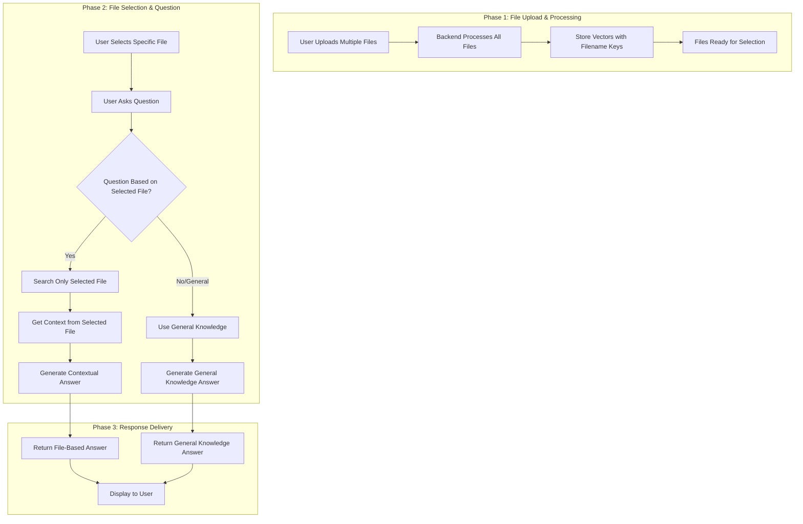
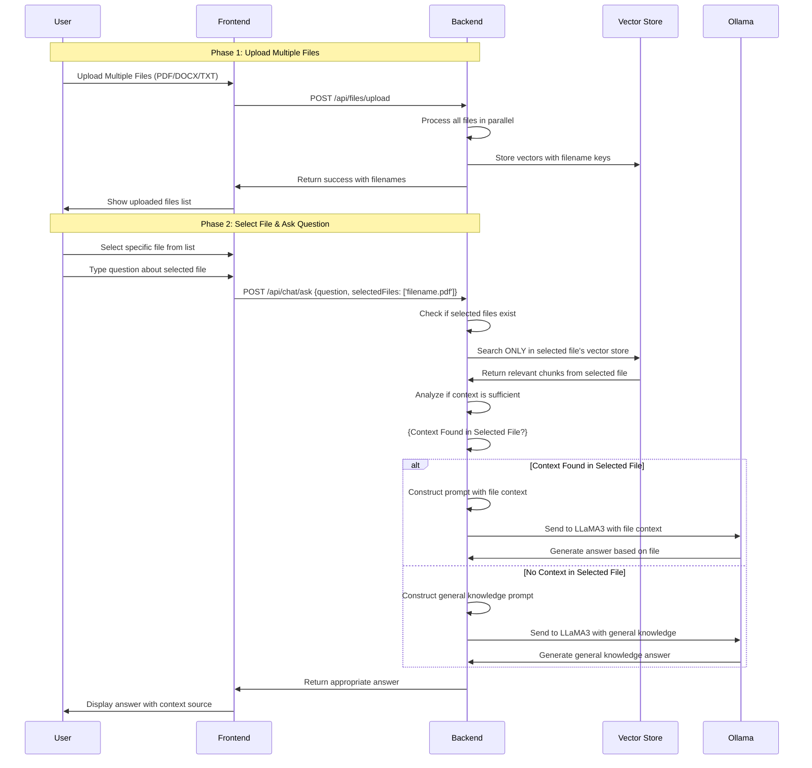
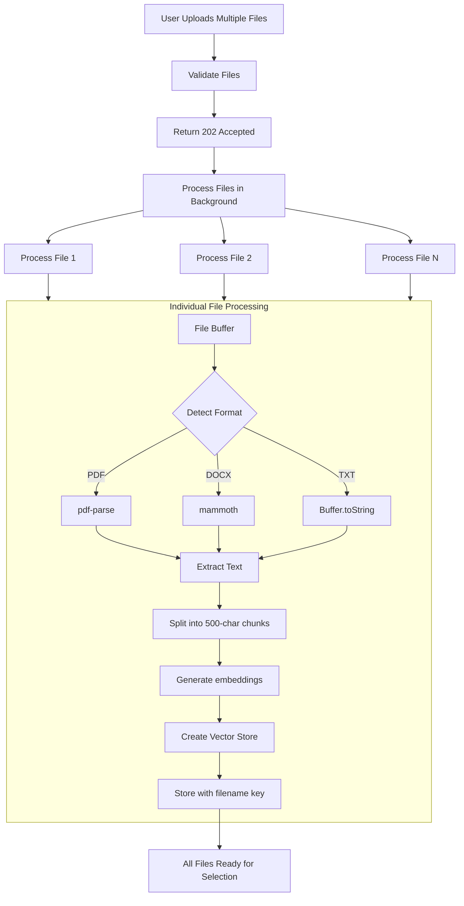
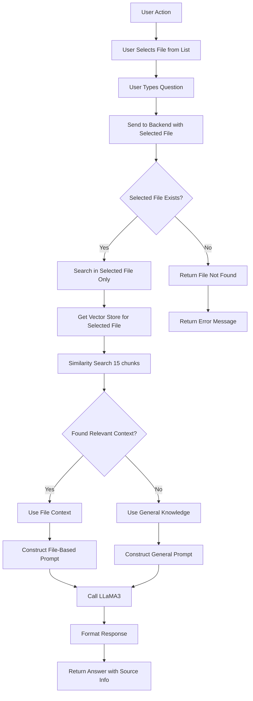

# 📄 PDF Chatbot with LangChain, Ollama, and React
A full-stack chatbot application that lets you upload PDF files and ask questions about their content. Powered by LangChain, Ollama, Express.js, and React.
## video 
   👉 https://drive.google.com/file/d/1FN2SRntK-MUbh0TCwWO3SNhMAmiTs2vZ/view?usp=drive_link

## 🚀 Features

- Upload multiple PDF, DOCX, TXT files (20MB max each)
- Extracts and embeds content using LangChain
- Ask questions about file contents or general topics
- Fast answers via local LLaMA3 model
- Toggle light/dark mode
- Delete uploaded files
- No external storage — all in-memory

## Overall System Flow

## End-to-End User

## File Upload Workflow

## File Selection & Question Workflow

## 🧱 Tech Stack

- **Frontend**: React, Axios, CSS
- **Backend**: Node.js, Express, Multer
- **AI/LLM**: [Ollama](https://ollama.com/) (LLaMA3 + nomic-embed-text)
- **Vector Store**: LangChain `MemoryVectorStore`
- **Text Splitting**: LangChain `RecursiveCharacterTextSplitter`
- **PDF Parsing**: `pdf-parse`

  ## 📡 API Endpoints

| Method   | Endpoint             | Description                                                               |
|----------|----------------------|---------------------------------------------------------------------------|
| `POST`   | `/api/files/upload`  | Upload up to 5 files (PDF, DOCX, TXT). Files are parsed and embedded.     |
| `POST`   | `/api/chat/ask`      | Ask a question. Can be general or based on uploaded files.                |
| `DELETE` | `/api/files/delete`  | Delete a file from memory by filename.                                    |
| `GET`    | `/api/files/debug`   | Get a list of currently stored filenames in memory (for development use). |

## Start Ollama with Required Models
Install Ollama if you haven't:
👉 https://ollama.com/download
` ``bash
  ollama pull nomic-embed-text
  ollama pull llama3
                       ` `
## Backend Setup

    ` ``bash
          cd backend
          npm install
          node app.js 
           

## Frontend Setup
    ` ``bash
         cd frontend
        npm install
        npm start
                   ` `
Frontend runs on: http://localhost:3000
