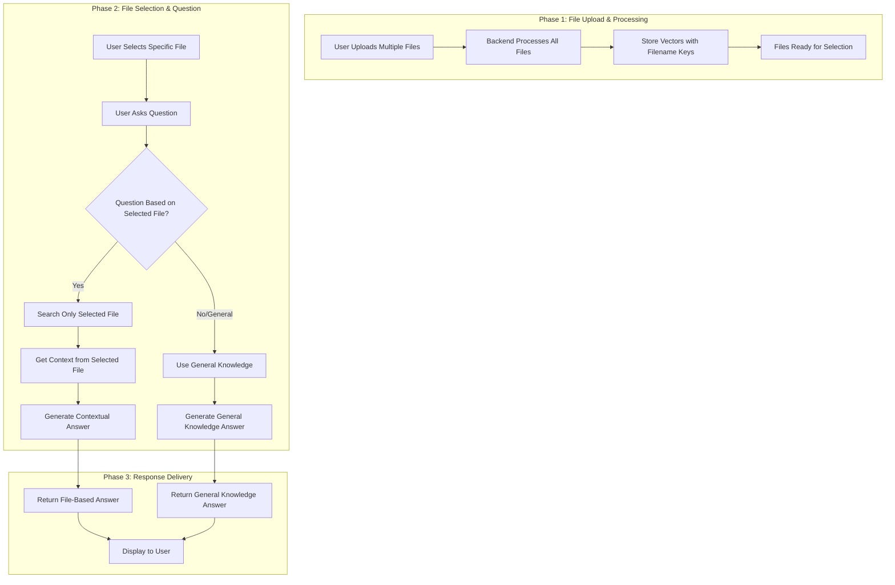

# 📄 PDF Chatbot with LangChain, Ollama, and React
A full-stack chatbot application that lets you upload PDF files and ask questions about their content. Powered by LangChain, Ollama, Express.js, and React.

## Understanding the Problem

In most traditional document review or information retrieval workflows, users have to manually search through lengthy documents to find relevant information. This process is time-consuming, inefficient, and prone to human error — especially when dealing with large or multiple files.

Users need a fast and intelligent way to:
- Upload various document types,
- Automatically extract and understand the content,
- Ask context-based questions,
- And receive instant, accurate answers — without relying on external APIs or cloud storage.

---

## Problem Statement

Most document-based AI chatbots either depend on cloud-based LLMs (raising privacy concerns) or fail to process multiple document types efficiently.  
There is a need for a **privacy-preserving, local, and efficient** document-questioning system that allows users to:
- Upload multiple documents,
- Ask questions based on document content or general knowledge,
- And retrieve answers quickly using local inference.

---

## Goal

To develop a **local, privacy-focused chatbot** that:
- Embeds and understands document content using LangChain,
- Utilizes **Ollama**’s **LLaMA3** model for local inference,
- Provides a seamless and fast question-answering interface,
- And operates completely offline, ensuring full data privacy.

---
## video 
👉 https://drive.google.com/file/d/1FN2SRntK-MUbh0TCwWO3SNhMAmiTs2vZ/view?usp=drive_link

## Features

- Upload multiple PDF, DOCX, TXT files (20MB max each)
- Extracts and embeds content using LangChain
- Ask questions about file contents or general topics
- Fast answers via local LLaMA3 model
- Toggle light/dark mode
- Delete uploaded files
- No external storage — all in-memory

| **ID** | **Requirement** | **Description** |
|--------|------------------|-----------------|
| 1 | File Upload | Users can upload up to 5 files (PDF, DOCX, or TXT formats). |
| 2 | File Parsing | Backend extracts text content using `pdf-parse` or relevant parser. |
| 3 | Embedding Generation | Each uploaded file is embedded using LangChain’s `nomic-embed-text`. |
| 4 | File-Based Questioning | Users can ask questions specific to a selected file. |
| 5 | General Questioning | Users can ask general questions answered by the LLM without file context. |
| 6 | Answer Retrieval | System retrieves top matching embeddings and generates contextual answers. |
| 7 | File Deletion | Users can delete specific files from in-memory vector store. |
| 8 | Debug Endpoint | Developers can view stored filenames for debugging via `/api/files/debug`. |
| 9 | Frontend Interaction | Frontend communicates with backend via REST API. |
| 10 | Theme Support | Application supports light and dark mode toggles. |

---

## ⚖️ Non-Functional Requirements

| **Category** | **Requirement** | **Description** |
|---------------|------------------|-----------------|
| **Performance** | Response Time | System should return an answer within 3 seconds for typical queries. |
| **Scalability** | File Handling | Supports concurrent uploads and queries efficiently. |
| **Security** | Data Privacy | All file data and embeddings are stored in memory — no external storage. |
| **Usability** | UI Simplicity | Simple, intuitive interface for non-technical users. |
| **Reliability** | Fault Handling | Graceful handling of parsing or embedding errors. |
| **Maintainability** | Modular Code | Backend separated into controllers, routes, and middleware for easy maintenance. |
| **Compatibility** | Cross-Platform | Works on major browsers (Chrome, Edge, Firefox). |
| **Portability** | Local Execution | Can run entirely on a local machine using Ollama. |

## Architecture Design

## Tech Stack

- **Frontend**: React, Axios, CSS
- **Backend**: Node.js, Express, Multer
- **AI/LLM**: [Ollama](https://ollama.com/) (LLaMA3 + nomic-embed-text)
- **Vector Store**: LangChain `MemoryVectorStore`
- **Text Splitting**: LangChain `RecursiveCharacterTextSplitter`
- **PDF Parsing**: `pdf-parse`

  ## 📡 API Endpoints

| Method   | Endpoint             | Description                                                               |
|----------|----------------------|---------------------------------------------------------------------------|
| `POST`   | `/api/files/upload`  | Upload up to 5 files (PDF, DOCX, TXT). Files are parsed and embedded.     |
| `POST`   | `/api/chat/ask`      | Ask a question. Can be general or based on uploaded files.                |
| `DELETE` | `/api/files/delete`  | Delete a file from memory by filename.                                    |
| `GET`    | `/api/files/debug`   | Get a list of currently stored filenames in memory (for development use). |


## Start Ollama with Required Models
Install Ollama if you haven't:
👉 https://ollama.com/download
` ``bash
  ollama pull nomic-embed-text
  ollama pull llama3
                       ` `
## Backend Setup

``` bash
cd backend
npm install
node app.js 
```
## Frontend Setup
``` bash
cd frontend
npm install
npm start
```
Frontend runs on: http://localhost:3000
